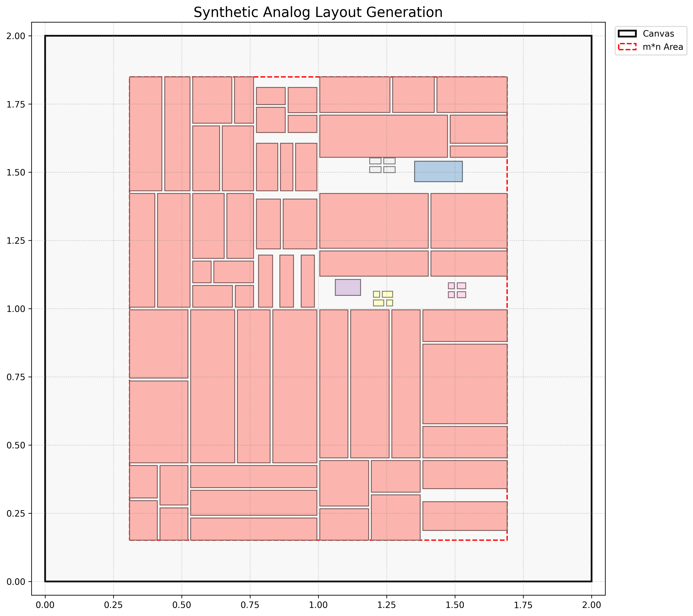

# Synthetic Analog Layout Generator (合成類比佈局生成器)

這是一個使用 Python 撰寫的程序化佈局生成器，旨在透過遞迴的幾何分割演算法，創建類似類比電路設計的抽象視覺佈局。

## 功能特性

- **遞迴式生成**：核心演算法使用遞迴方式，將大塊區域分割成越來越小的元件。
- **多樣化的切割規則**：內建多種切割規則，包括：
  - 垂直與水平分割
  - 四象限分割
  - 更複雜的對齊分割（可一次性切成 N 塊並設定對齊方式）
- **兩階段生成流程**：
  1. **中心佈局**：首先對一個核心矩形區域進行深度遞迴分割。
  2. **間隙填補**：在核心區域生成後，演算法會嘗試在剩餘空間中智慧地插入並分割新的「填補元件」。
- **高度可配置性**：所有關鍵參數都集中在 `config.py` 中，方便使用者調整，無需修改核心邏輯。
- **視覺化輸出**：使用 `matplotlib` 將生成的元件佈局繪製成圖片，並以不同顏色區分不同來源的元件群組。
- **模組化設計**：程式碼結構清晰，分為設定、主邏輯、元件定義、規則引擎和視覺化等模組，易於擴充。

## 檔案結構
.  
├── main.py               # 主執行檔，負責協調整個生成流程  
├── config.py             # 存放所有可配置的參數  
├── component.py          # 定義 Component 資料結構  
├── rule_engine.py        # 規則選擇與應用引擎  
├── visualization.py      # 負責將結果繪製成圖片  
├── rules/                  # 存放所有切割規則的模組  
│   ├── init.py             # (隱含) 處理規則的自動註冊   
│   ├── split_basic.py      # 包含垂直、水平、四象限等基本規則  
│   └── split_aligned.py    # 包含對齊切割規則  
└── synthetic_layout.png  # 預設的輸出圖片檔案名稱  

## 運作原理

1.  **初始化**：程式從 `config.py` 讀取設定，並在畫布中央建立一個初始的 `m*n` 矩形。
2.  **中心區域切割**：將此初始矩形作為根元件，進行 `K_ITERATIONS` 層的遞迴切割。在每一層，隨機選擇一個切割規則（如垂直、水平等）應用於當前元件，生成更小的子元件。
3.  **填補元件放置**：完成中心區域後，程式會嘗試生成 `NUM_FILLER_COMPONENTS` 組填補元件。它會在 `m*n` 區域內隨機選擇一個位置，如果該位置未與任何現有元件重疊，則放置一個新的填補元件。
4.  **填補元件切割**：成功放置的填補元件也會被進行 `J_ITERATIONS` 層的遞迴切割。
5.  **視覺化**：所有元件生成完畢後，`visualization.py` 會將所有元件繪製出來，並根據其來源群組 (`group_id`) 著色，最後儲存成圖片檔案。

## 如何使用

### 1. 環境設定

請確保您的環境中已安裝 Python 3 和 `matplotlib` 函式庫。

'''bash
# 安裝 matplotlib
pip install matplotlib
'''

### 2. 參數配置
打開 config.py 檔案，您可以調整以下參數來改變生成結果：
- CANVAS_WIDTH, CANVAS_HEIGHT: 整個畫布的尺寸。
- MN_RECT_WIDTH, MN_RECT_HEIGHT: 主要生成區域的尺寸。
- K_ITERATIONS: 中心區域的遞迴切割深度，值越大，中心元件越碎。
- J_ITERATIONS: 填補元件的遞迴切割深度。
- NUM_FILLER_COMPONENTS: 嘗試生成的填補元件組數。
- MIN_FILLER_SIZE, MAX_FILLER_SIZE: 填補元件的初始尺寸範圍。
- COMPONENT_GAP: 元件之間的間隙大小。

### 3. 執行
在終端機中，直接執行 main.py 檔案。
程式執行完成後，會自動彈出預覽視窗，並在專案根目錄下生成 synthetic_layout.png 圖片

## 如何擴充
若要新增自訂的切割規則，您可以：
1. 在 rules/ 資料夾下建立一個新的 Python 檔案。
2. 在該檔案中定義您的新規則函式，其第一個參數必須是 Component 物件，並返回一個 List[Component]。
3. (假設 rules/__init__.py 中有自動註冊機制) 將您的函式匯入到 rules/__init__.py 中，RuleSelector 就能自動找到並使用它。